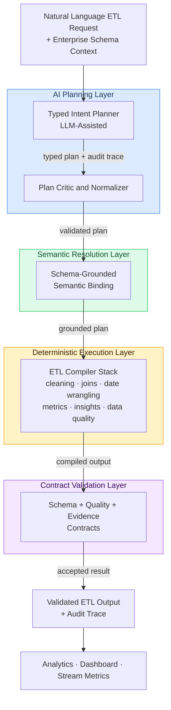

<div align="center">

# ConversaETL

### Enterprise Conversational ETL Platform

**Generative AI · Typed Planning · Deterministic Execution · Contract Validation**

[](https://github.com/houcem58/ConversaETL-Showcase/actions/workflows/ci.yml)
[](docs/FAQ.md#research)
[](LICENSE)
[](docs/Architecture.md)
[](demo/examples/)

</div>

---

> ConversaETL converts natural-language data requests into validated, auditable ETL
> transformations — combining LLM-assisted typed planning with a deterministic
> compilation engine that enforces output contracts before any result is accepted.
>
> **This repository is a portfolio showcase.** The full implementation is private.
> Published at *Data Science and Engineering* (Springer, 2026).

---

## The Problem

Enterprise data teams face a persistent gap between business questions and data access.

Traditional ETL pipelines require months of engineering effort per schema. Analysts
wait for engineering bandwidth. Business questions outpace pipeline delivery. When
schemas change, pipelines break silently.

Existing approaches fail in predictable ways:

| Approach | Failure Mode |
|----------|-------------|
| Manual SQL / pipeline engineering | High lead time, schema-coupled, brittle |
| Text-to-SQL | Fails on cleaning, joins, temporal logic, multi-schema |
| Direct LLM code generation | Produces unsafe code, hallucinates columns, no contracts |
| Traditional BI tools | Require pre-modelled schemas, no conversational access |

The core problem is not that enterprises lack data. It is that the path from a
business question to a verified data transformation is too slow, too fragile, and
too dependent on specialized engineering knowledge.

---

## The Solution

ConversaETL addresses this by separating three concerns that current systems conflate:

**Intent inference is probabilistic.** Language models are good at understanding
what a user wants. ConversaETL uses an LLM to produce a structured, typed plan —
not executable code.

**Execution is deterministic.** A family of bounded compilers translates typed
plans into auditable data transformations. The system does not execute arbitrary
LLM-generated code.

**Acceptance is governed by contracts.** Output contracts validate schema shape,
quality constraints, and evidence requirements before any result is returned.

This architecture makes failure modes explicit, auditable, and recoverable —
properties that direct LLM code generation cannot provide.

---

## Architecture



The full architecture is documented in [docs/Architecture.md](docs/Architecture.md).

---

## Key Capabilities

### Conversational Data Access
Users express data requests in natural language. ConversaETL resolves schema
context, compiles the transformation, and returns a validated result — no SQL
required, no pipeline engineering, no schema pre-modelling.

```
Input:  "Compare Q1 and Q2 delivery delays by carrier, show percentage change"

Output: Structured result table with:
        carrier | Q1_delay_days | Q2_delay_days | pct_change | direction
        --------+---------------+---------------+------------+-----------
        CarrierA|          3.2  |          2.8  |      -12.5 | decrease
        CarrierB|          5.1  |          5.6  |       +9.8 | increase
        ...

        Audit trace: task=date_wrangling, metric=delivery_delay_days,
                     periods=[Q1,Q2], operator=period_delta
```

### Enterprise Schema Understanding
The semantic resolution layer grounds natural-language metric and entity references
to actual schema columns across multi-table, heterogeneous schemas — handling
synonyms, derived metrics, ambiguous column names, and cross-table relationships.

### Deterministic Compiler Stack
Seven compiler families cover the full range of enterprise ETL operations:

| Compiler Family | Operations |
|----------------|-----------|
| Cleaning | Missingness, type validation, duplicate handling, outlier detection |
| Date Wrangling | Period bucketing, temporal deltas, latency metrics, quarterly aggregation |
| Joins | Explicit key structure, cardinality guards, post-join contract checks |
| Transform | Derived metrics, aggregations, sorting, schema reshaping |
| Grounded Insight | Evidence-backed exploratory analysis, entity comparisons, concentration |
| Data Quality | Profiling, expectation checks, quality scoring |
| Insight Discovery | Structured insight synthesis from unstructured exploratory requests |

### Contract-Validated Outputs
Every result passes schema contracts, quality constraints, and evidence requirements
before being returned. Invalid outputs are blocked — not repaired silently.

### Streaming Pipeline Support
A Kafka-backed streaming component enables operational monitoring, drift detection,
and windowed feature evaluation for real-time ETL scenarios.

### Reproducible Benchmark — ConversaBench
A full evaluation framework with task-family labels, gold references, repeated
reliability rows, semantic-stress subsets, ablation variants, and frozen evidence
artifacts. Designed as a benchmark contribution for verifiable conversational ETL,
not only as an internal test suite.

---

## Evaluation Results

Evaluated across **approximately 1,500 total system-prompt executions**:

- **ConversaBench-Full** — 125 prompts × 3 repeats × 3 systems = 1,125 rows
- **Spider-ETL-mini** — 50 cross-schema prompts × 3 repeats × 2 systems = 300 rows

Datasets: NASA HTTP logs (1.5M records), Online Retail II (541K transactions),
Olist multi-table e-commerce (9 relational tables).

| System | Mean Correctness | Delta vs Baseline | Success Rate |
|--------|:---------------:|:-----------------:|:------------:|
| **ConversaETL — Hybrid Compiler** | **0.964** | **+0.274** | **100%** |
| Compiler-only baseline | 0.690 | — | 96% |
| Direct LLM codegen baseline | 0.308 | −0.382 | 70% |

**95% clustered bootstrap CI for delta: [0.218, 0.332]**

Performance on semantically demanding tasks:

| Evaluation Layer | Delta |
|-----------------|:-----:|
| Semantic-stress subset (35 high-difficulty prompts) | +0.356 |
| Strong expected-gain subset | +0.407 |
| Cross-schema generalization (Spider-ETL-mini) | +0.301 |

The direct LLM baseline demonstrates the failure modes of unconstrained code
generation under the same evaluation conditions — not as a general LLM benchmark.

See the demo in [demo/examples/](demo/examples/) for a synthetic illustration of
the pipeline. Full benchmark artifacts are in the private research repository.

---

## Enterprise Engineering

### Observability
Every transformation produces an audit trace recording task family, operator,
input schema, output shape, contract decisions, and latency. Failed transformations
are logged with structured failure reasons, not swallowed.

### Streaming Support
Kafka-backed event streaming enables real-time drift detection, operational
monitoring, and windowed aggregate computation alongside batch ETL workflows.

### Container-First Deployment
Full Docker and Docker Compose support for reproducible local deployment.
The pipeline, benchmark, and dashboard components run within a single compose stack.

### Multi-Provider LLM Support
The planning layer supports Groq (cloud), Ollama (local/offline), and any
OpenAI-compatible provider — selectable via environment configuration with no
code changes.

### Governance and Auditability
Contract validation, audit traces, and structured failure reasons make every
transformation inspectable. The system is designed for environments where
data governance and output accountability are requirements, not afterthoughts.

---

## Business Value

A detailed analysis is in [docs/BusinessCase.md](docs/BusinessCase.md).

### Engineering Productivity
Schema-specific ETL pipeline development is eliminated for supported task families.
Analysts generate and validate transformations conversationally rather than opening
tickets and waiting for engineering delivery.

### Governance and Compliance
Deterministic compilers and output contracts create a traceable transformation path.
Every accepted output has an audit record. Unsafe operations are blocked by design,
not detected post-execution.

### Reliability
The 100% execution success rate on the full benchmark reflects the contract
architecture — invalid outputs are rejected rather than silently accepted.
Direct LLM code generation produces a 30% execution failure rate under the same
conditions.

### Time-to-Insight Reduction
Conversational ETL compresses the typical schema-to-insight cycle from days
(pipeline engineering + QA + deployment) to minutes for supported query patterns.

### Cross-Schema Generalization
The cross-schema evaluation demonstrates that the system maintains correctness
on unseen schemas (+0.301 delta on Spider-ETL-mini), reducing the engineering
overhead of onboarding new data sources.

---

## Technology Stack

| Domain | Technologies |
|--------|-------------|
| AI / LLM Planning | LLM-assisted typed planner (Groq, Ollama, OpenAI-compatible) |
| ETL Compilation | Python, pandas, NumPy — deterministic bounded operators |
| Evaluation & Statistics | SciPy, scikit-learn, clustered bootstrap CI |
| Streaming | Apache Kafka |
| Visualization | Plotly, Dash, Gradio |
| Infrastructure | Docker, Docker Compose |
| Benchmark | ConversaBench (internal), Spider-ETL-mini (cross-schema extension) |

---

## Demo

The [demo/](demo/) folder contains a self-contained illustration of the
ConversaETL pipeline using synthetic data. It demonstrates the interaction
model and conceptual pipeline stages without requiring access to the research
implementation.

```bash
cd demo/examples
pip install pandas
python 01_basic_query.py
python 02_multi_table_analysis.py
```

See [demo/README.md](demo/README.md) for full instructions.

---

## Documentation

| Document | Description |
|----------|-------------|
| [Architecture](docs/Architecture.md) | System design, component overview, design principles |
| [Business Case](docs/BusinessCase.md) | Problem analysis, value proposition, ROI framework |
| [Use Cases](docs/UseCases.md) | Supported ETL patterns with synthetic examples |
| [Future Work](docs/FutureWork.md) | Research roadmap and production extension directions |
| [FAQ](docs/FAQ.md) | Common questions about the project and research |
| [Roadmap](ROADMAP.md) | Platform development roadmap |

---

## Research

ConversaETL is applied AI research positioned at the intersection of conversational
interfaces, data engineering, and LLM-assisted compilation.

**Five contributions:**

1. **Architecture** — Typed intermediate representation separating probabilistic
   intent inference from deterministic ETL execution
2. **Compiler stack** — Deterministic operator families covering cleaning, temporal
   reasoning, joins, derived metrics, and exploratory insights
3. **Benchmark** — ConversaBench as a reproducible evaluation framework with
   task families, gold references, repeated rows, and frozen evidence artifacts
4. **Evaluation** — Repeat-matched HC/CO/LLM comparison with clustered bootstrap
   confidence intervals and ablation analysis
5. **Operational validation** — Streaming drift, dashboard specification scoring,
   and local-provider robustness as supporting evidence

> Houcem Hammami, Afef Kacem Echi —
> *ConversaETL and ConversaBench: Typed Planning and Deterministic Compilation
> for Verifiable Conversational ETL*
>
> Published at **Data Science and Engineering** (Springer, 2026).

---

## About

This project was designed, architected, and led by **Houcem Hammami** as part of
applied AI research in enterprise data engineering and conversational AI systems.

The work spans AI platform design, deterministic compiler engineering, benchmark
methodology, statistical evaluation, and streaming pipeline development.

**Open to:** Technical Manager, AI Platform Lead, Engineering Manager — AI/Data roles.

Connect: [LinkedIn](https://linkedin.com/in/houcem-hammami) ·
Email: houcem0508@gmail.com

---

## License

[Apache-2.0](LICENSE) — Code and documentation in this repository.
The research implementation, benchmark internals, and evaluation artifacts
remain in a private repository. See [SECURITY.md](SECURITY.md) for scope.
