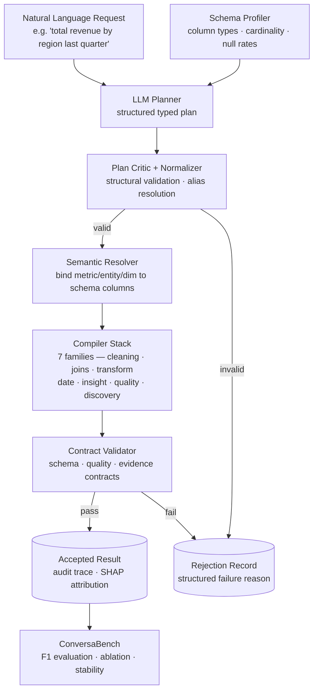

# ConversaETL — System Architecture

This document describes the ConversaETL architecture at the design level.
Implementation details, compiler internals, and evaluation engine components
are not disclosed here.

---

## Design Principles

### 1. Separate Probabilistic Inference from Deterministic Execution

The central design decision in ConversaETL is the explicit separation between
what the language model does and what the execution engine does.

The LLM is bounded to the **planning stage**: it infers intent, task family,
metric references, temporal grain, filters, and operator type — producing a
structured typed plan. It does not generate executable transformation code.

The **execution stage** is handled entirely by deterministic compilers. These
compilers take the typed plan as input and emit bounded dataframe operations
whose behavior is fully predictable given the plan and schema.

This separation makes failure modes explicit:
- If the LLM misunderstands the intent, the plan critic catches it
- If schema references are wrong, the semantic resolver catches it
- If the output is malformed, the contract layer catches it

**No failure mode is silent.**

### 2. Contract-First Acceptance

Output contracts are not optional validation — they are the acceptance gate.
An output that fails a contract is not returned, not repaired silently, and
not passed downstream. It is rejected with a structured failure reason.

This design is appropriate for data-engineering contexts where a wrong
transformation is worse than no transformation — it is incorrect evidence.

### 3. Schema Grounding Before Compilation

Natural-language metric and entity references are resolved to actual schema
columns before any compilation occurs. This prevents the most common failure
mode of LLM-based data systems: hallucinated column names and misbound metrics.

### 4. Audit by Default

Every transformation — whether it succeeds or fails — produces a structured
audit trace recording the task family, operator selected, schema bindings,
contract decisions, and latency. Audit traces are not optional instrumentation.
They are first-class outputs of the pipeline.

---

## Five-Stage Pipeline

```
┌─────────────────────────────────────────────────────────────────┐
│                                                                 │
│  STAGE 1 — AI Planning Layer                                   │
│                                                                 │
│  Input:  Natural language request + schema context              │
│  Output: Typed intermediate plan + initial audit trace          │
│                                                                 │
│  The LLM-assisted planner maps the request to a structured      │
│  typed plan containing: task family, operator family, metric    │
│  references, entity references, temporal grain, filter          │
│  conditions, and join requirements.                             │
│                                                                 │
│  The planner does NOT generate code. It generates a plan.       │
│                                                                 │
└────────────────────────────┬────────────────────────────────────┘
                             │ typed plan
                             ▼
┌─────────────────────────────────────────────────────────────────┐
│                                                                 │
│  STAGE 2 — Plan Critique and Normalization                     │
│                                                                 │
│  Input:  Raw typed plan                                         │
│  Output: Validated, normalized plan — or rejection              │
│                                                                 │
│  The plan critic validates structural constraints: required     │
│  fields present, operator-family consistency, task-family       │
│  invariants, and absence of unsupported combinations.           │
│                                                                 │
│  The plan normalizer resolves aliases, standardizes field       │
│  formats, and resolves ambiguities using schema context.        │
│                                                                 │
│  Rejected plans produce a structured failure record.            │
│  They do not proceed to compilation.                            │
│                                                                 │
└────────────────────────────┬────────────────────────────────────┘
                             │ validated plan
                             ▼
┌─────────────────────────────────────────────────────────────────┐
│                                                                 │
│  STAGE 3 — Schema-Grounded Semantic Resolution                 │
│                                                                 │
│  Input:  Validated plan + profiled schema                       │
│  Output: Fully grounded plan with column bindings              │
│                                                                 │
│  The semantic resolver binds metric references, entity          │
│  references, and dimension references to actual schema          │
│  columns. It handles synonyms, derived metrics, ambiguous       │
│  column names, and cross-table relationships.                   │
│                                                                 │
│  Unresolvable references are flagged before compilation.        │
│  Schema guards block references to non-existent columns.        │
│                                                                 │
└────────────────────────────┬────────────────────────────────────┘
                             │ grounded plan
                             ▼
┌─────────────────────────────────────────────────────────────────┐
│                                                                 │
│  STAGE 4 — Deterministic ETL Compilation and Execution         │
│                                                                 │
│  Input:  Grounded typed plan + source data                      │
│  Output: Compiled transformation result                         │
│                                                                 │
│  Seven compiler families cover the full ETL operation space.   │
│  Each compiler emits bounded, inspectable dataframe operations. │
│                                                                 │
│  Cleaning      — missingness, type validity, deduplication      │
│  Date wrangling — period bucketing, temporal deltas, latency    │
│  Joins         — key-explicit joins with cardinality guards     │
│  Transform     — derived metrics, aggregation, reshaping        │
│  Grounded insight — evidence-backed exploratory analysis        │
│  Data quality  — profiling, expectation checks, scoring         │
│  Insight discovery — structured insight synthesis               │
│                                                                 │
│  Compilation is schema-context-aware: T = K(P, S)              │
│                                                                 │
└────────────────────────────┬────────────────────────────────────┘
                             │ compiled output
                             ▼
┌─────────────────────────────────────────────────────────────────┐
│                                                                 │
│  STAGE 5 — Contract Validation and Acceptance                  │
│                                                                 │
│  Input:  Compiled result + contract specification               │
│  Output: Accepted result + audit trace — or rejection           │
│                                                                 │
│  pass(Y, C) = 1 iff schema(Y) ⊨ C_s ∧ quality(Y) ⊨ C_q       │
│                                                                 │
│  Schema contracts: required columns, shape, null bounds         │
│  Quality contracts: evidence requirements, value bounds         │
│  Evidence contracts: insight tuples must include required       │
│                      entity, metric, period, direction fields   │
│                                                                 │
│  Only outputs passing all contracts are returned as results.    │
│  Rejections are logged with structured failure reasons.         │
│                                                                 │
└─────────────────────────────────────────────────────────────────┘
```

---

## Supporting Components

### Schema Profiler
Builds a runtime profile of the input data source — column names, types,
cardinality estimates, null rates, value distributions, and detected
relationships. The profile is used by the semantic resolver and compiler stack.

### Streaming Pipeline
A Kafka-backed streaming component extends the batch ETL model to operational
monitoring scenarios. Windowed feature computation, drift detection, and
event-level anomaly scoring run on the same schema-grounded semantic model.

### Dashboard
A Gradio/Dash-based interactive interface for conversational ETL requests,
result visualization, and benchmark performance monitoring. Supports real-time
result streaming and chart specification generation.

### ConversaBench
A reproducible evaluation benchmark with:
- Task-family labels for structured failure analysis
- Gold reference outputs (tables, scalars, insight tuples)
- Repeated reliability rows for variance estimation
- Semantic-stress subsets for ablation
- Frozen evidence artifacts for claim-to-artifact traceability
- Cross-schema extension (Spider-ETL-mini) for generalization testing

---

## Evaluation Architecture

The system is evaluated under three conditions:

**HC — Hybrid Compiler:** Full pipeline with LLM-assisted planning and
deterministic compilation. This is the primary system.

**CO — Compiler-only baseline:** Deterministic compilation without LLM planning.
Tests whether typed planning adds value over schema-only compilation.

**LLM — Direct code generation:** LLM generates transformation code end-to-end.
Evaluated as a failure-mode baseline under the same no-fallback policy.

This three-way comparison isolates the contribution of each architectural layer.

---

## Design Boundaries

ConversaETL is explicitly **not** positioned as:

- A general text-to-SQL system (it targets ETL operators, not SQL query generation)
- A replacement for workflow orchestration tools (Airflow, dbt, Talend)
- A universal LLM agent framework
- A text-to-SQL system (different operator scope — ETL, not query generation)

It is positioned as: a typed compilation approach to verifiable conversational ETL,
evaluated under controlled benchmark conditions with frozen reproducibility artifacts.

---

## Component Diagram


