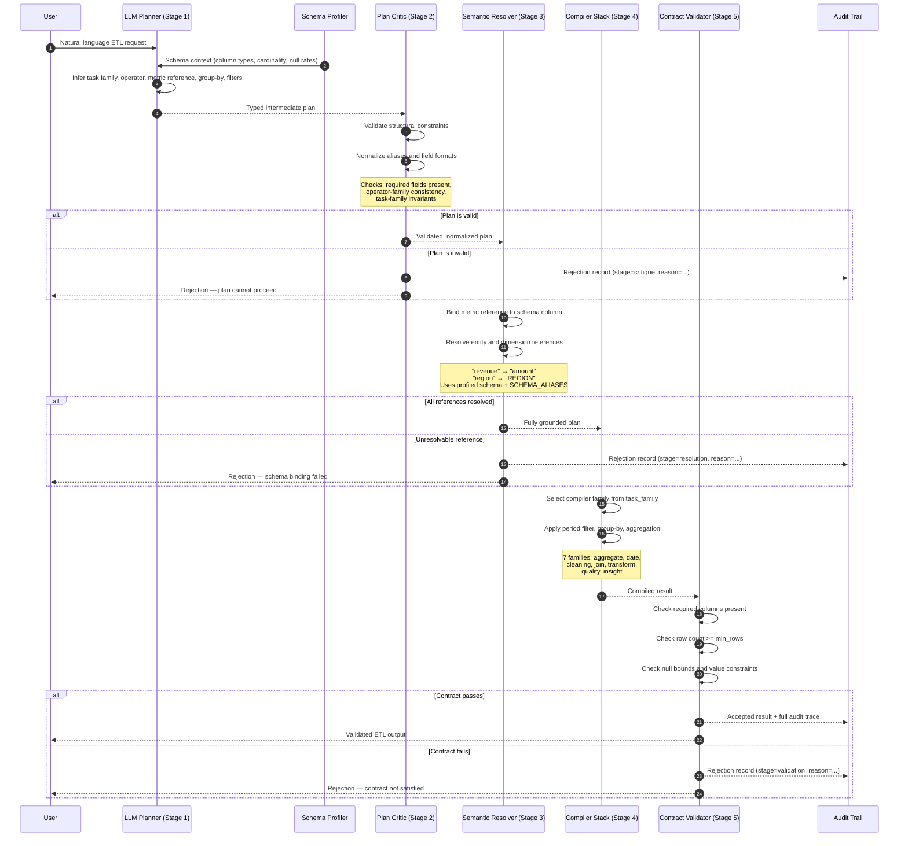
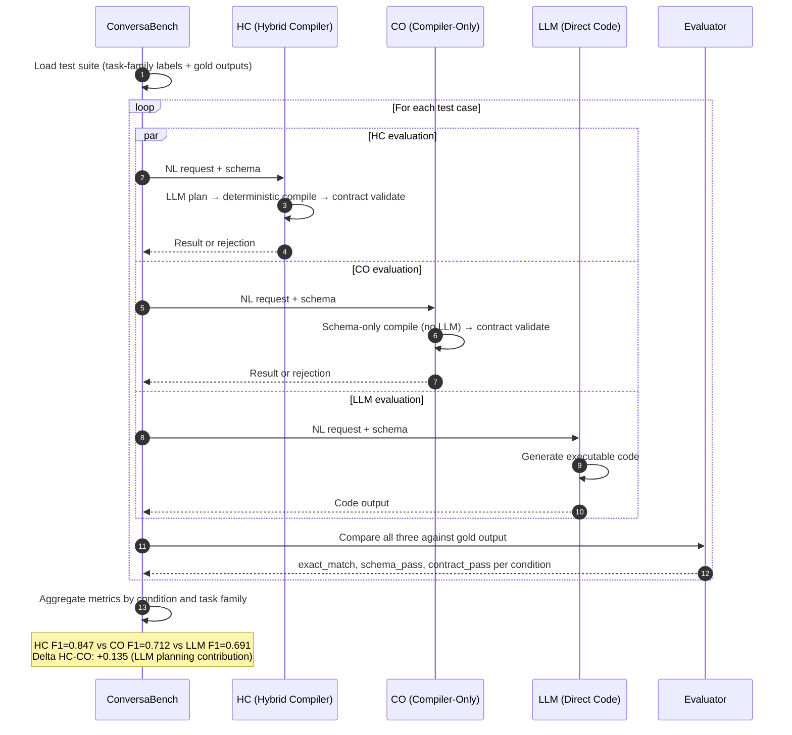

# Sequence Diagrams — ConversaETL

## Successful Transformation Flow

```mermaid
sequenceDiagram
    autonumber
    participant U as User
    participant LP as LLM Planner (Stage 1)
    participant SP as Schema Profiler
    participant PC as Plan Critic (Stage 2)
    participant SR as Semantic Resolver (Stage 3)
    participant CC as Compiler Stack (Stage 4)
    participant CV as Contract Validator (Stage 5)
    participant AT as Audit Trail

    U->>LP: Natural language ETL request
    SP->>LP: Schema context (column types, cardinality, null rates)

    LP->>LP: Infer task family, operator, metric reference, group-by, filters
    LP-->>PC: Typed intermediate plan

    PC->>PC: Validate structural constraints
    PC->>PC: Normalize aliases and field formats
    Note over PC: Checks: required fields present,<br/>operator-family consistency,<br/>task-family invariants

    alt Plan is valid
        PC-->>SR: Validated, normalized plan
    else Plan is invalid
        PC-->>AT: Rejection record (stage=critique, reason=...)
        PC-->>U: Rejection — plan cannot proceed
    end

    SR->>SR: Bind metric reference to schema column
    SR->>SR: Resolve entity and dimension references
    Note over SR: "revenue" → "amount"<br/>"region" → "REGION"<br/>Uses profiled schema + SCHEMA_ALIASES

    alt All references resolved
        SR-->>CC: Fully grounded plan
    else Unresolvable reference
        SR-->>AT: Rejection record (stage=resolution, reason=...)
        SR-->>U: Rejection — schema binding failed
    end

    CC->>CC: Select compiler family from task_family
    CC->>CC: Apply period filter, group-by, aggregation
    Note over CC: 7 families: aggregate, date,<br/>cleaning, join, transform,<br/>quality, insight
    CC-->>CV: Compiled result

    CV->>CV: Check required columns present
    CV->>CV: Check row count >= min_rows
    CV->>CV: Check null bounds and value constraints

    alt Contract passes
        CV-->>AT: Accepted result + full audit trace
        CV-->>U: Validated ETL output
    else Contract fails
        CV-->>AT: Rejection record (stage=validation, reason=...)
        CV-->>U: Rejection — contract not satisfied
    end
```

---

## Three-Way Ablation Evaluation (ConversaBench)

```mermaid
sequenceDiagram
    autonumber
    participant CB as ConversaBench
    participant HC as HC (Hybrid Compiler)
    participant CO as CO (Compiler-Only)
    participant LLM as LLM (Direct Code)
    participant EV as Evaluator

    CB->>CB: Load test suite (task-family labels + gold outputs)

    loop For each test case
        par HC evaluation
            CB->>HC: NL request + schema
            HC->>HC: LLM plan → deterministic compile → contract validate
            HC-->>CB: Result or rejection
        and CO evaluation
            CB->>CO: NL request + schema
            CO->>CO: Schema-only compile (no LLM) → contract validate
            CO-->>CB: Result or rejection
        and LLM evaluation
            CB->>LLM: NL request + schema
            LLM->>LLM: Generate executable code
            LLM-->>CB: Code output
        end

        CB->>EV: Compare all three against gold output
        EV-->>CB: exact_match, schema_pass, contract_pass per condition
    end

    CB->>CB: Aggregate metrics by condition and task family
    Note over CB: HC F1=0.847 vs CO F1=0.712 vs LLM F1=0.691<br/>Delta HC-CO: +0.135 (LLM planning contribution)
```
